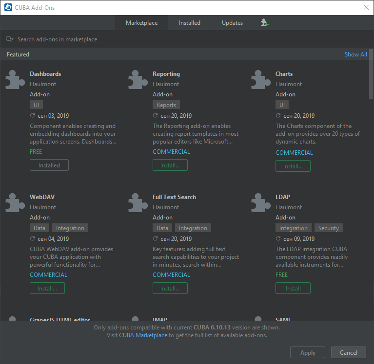

# CUBA ZooKeeper Integration Add-on

## Overview

The add-on is designed for coordinating CUBA cluster using [ZooKeeper](https://zookeeper.apache.org/).

Standard CUBA implementation of service discovery assumes that there is a static fixed list of available middleware servers. This list must be provided both for inter-server communication mechanism based on JGroups and for clients connecting to the cluster.

The add-on allows cluster members and clients to communicate through a ZooKeeper instance or ensemble. It enables simple and uniform configuration of middleware and client blocks: they need only the ZooKeeper address to form the cluster and to connect to it. In other words, the add-on provides dynamic service discovery.

## Installation

The add-on can be added to your project in one of the ways described below. Installation from the Marketplace is the simplest way. The last version of the add-on compatible with the used version of the platform will be installed.
Also, you can install the add-on by coordinates choosing the required version of the add-on from the table.

In case you want to install the add-on by manual editing or by building from sources see the complete add-ons installation guide in [CUBA Platform documentation](https://doc.cuba-platform.com/manual-latest/manual.html#app_components_usage).

### From the Marketplace

1. Open your application in CUBA Studio. Check the latest version of CUBA Studio on the [CUBA Platform site](https://www.cuba-platform.com/download/previous-studio/).
2. Go to *CUBA -> Marketplace* in the main menu.

 

3. Find the *ZooKeeper* add-on there.

 

4. Click *Install* and apply the changes.
The add-on corresponding to the used platform version will be installed.

### By coordinates

1. Open your application in CUBA Studio. Check the latest version of CUBA Studio on the [CUBA Platform site](https://www.cuba-platform.com/download/previous-studio/).
2. Go to *CUBA -> Marketplace* in the main menu.
3. Click the icon in the upper-right corner.

 

4. Paste the add-on coordinates in the corresponding field as follows:

 `com.haulmont.addon.zookeeper:cubazk-global:<add-on version>`

 where `<add-on version>` is compatible with the used version of the CUBA platform.

 | Platform Version | Add-on Version |
|------------------|----------------|
| 7.1.x            | 1.7.0          |
| 7.0.x            | 1.6.0          |
| 6.10.x           | 1.5.0          |
| 6.9.x            | 1.4.0          |
| 6.8.x            | 1.3.1          |
| 6.7.x            | 1.2.0          |
| 6.6.x            | 1.1.0          |
| 6.5.x            | 1.0.0          |

5. Click *Install* and apply the changes. The add-on will be installed to your project.

## Usage

Launch ZooKeeper on your network. Further, it is assumed that the ZooKeeper address is `192.168.0.1:2181`.

Configure your middleware and client blocks using application properties as described below. You can specify default values of the properties in a project's `app.properties` file and later override them on the deployment stage with Java system properties for a particular server instance.

### Configuring Middleware Servers

* Set up `cuba.webHostName`, `cuba.webPort`, `cuba.webContextName` application properties to form a unique [Server ID](https://doc.cuba-platform.com/manual-latest) for each middleware block.

* Set the following application properties for work in cluster:

        # Turn on cluster communication
        cuba.cluster.enabled = true

        # Use ZooKeeper for inter-server discovery
        cuba.cluster.jgroupsConfig = jgroups_zk.xml

        # Specify the address of the current server
        jgroups.bind_addr = 192.168.0.10

        # Specify ZooKeeper address
        jgroups.zkping.connection = 192.168.0.1:2181

### Configuring Web Client Blocks

* Set the following application properties to connect to the middleware cluster:

        # Use remote invocation
        cuba.useLocalServiceInvocation = false

        # Specify ZooKeeper address
        cubazk.connection = 192.168.0.1:2181
